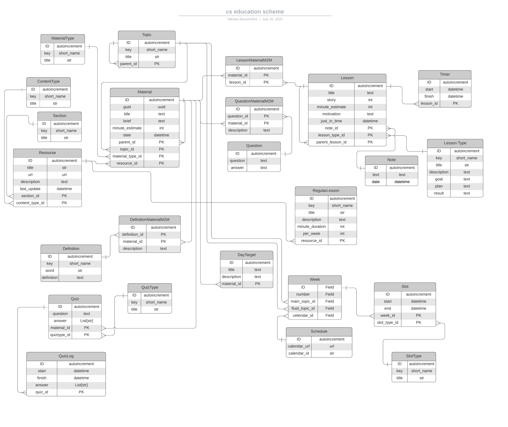

# Инструменты для работы с материалами и планом

Для качественного освоения и изучения материалов, нужны инструменты, нативно интегрирующиеся в тем жизни.
Материалы должны быть оценены, взвешаны и предложены в наиболее подходящий момент.
Материалы нужно обсуждать, а результатами делиться. Без этого процесс образования становится не полноценным.

- Индексация и упорядочивание материалов, процесса обучения
- Повторение материалов / Quiz
- Обсуждение
- Статистика по результатам

## Объекты

### Схема данных



### Материалы/ресурсы

Материалы и ресурсы составляют больший объем. Они содержат все, что нужно выучить в атомарной форме, чтобы учиться по частям

1. Добавляются ресурсы, тегируются, помечаются секцией
2. Из ресурса формируются материалы, материалы должны содержать только текст либо ссылку на неделимый объект
3. Материалы могут состоять из других материалов
4. Материалы должны быть оценены по времени, тегированы, привязаны к секциям и темам
5. Материалы должны быть покрыты Квизами

Тип ресурса:

- Статья
- Книга
- Лекция
- Доклад
- Документация
- Интерактив

Тип материала:

- Текст
- Видео
- Интерактив
- live

### Квизы

Нужны для повторение/усвоения материалов/самоконтроля

1. Квизы привязаны к материалам. Если не правильно ответить на квиз, нужно отправить ссылку на материал, который нужно повторить
2. Квиз может быть какой-то задачей на запоминание. К примеру: `Что делает команда?` Или `С помощью какой команды можно ...`

Типы квизов:

- Свободный ответ
- True/False
- Один правильный ответ
- Несколько правильных ответов


### Уроки

Уроки формируются из материалов. Один урок может cостоять несколько других материалов. Уроки должны включать в себя все,
что связанно с самим процессом обучения.

- Мотивация урока: Зачем учить это, что мне это даст
- Которкая выжимка: о чем этот урок
- Цель урок: Список квизов, которые включены в этот урок
- Резюме по уроку: Ответы на квизы

1. Перед началом урока можно посмотреть -- какие есть квизы по уроку
2. В процессе можно создавать свои собствственные квизы
3. В процессе можно добавлять заметки
4. В уроки добавляются таймеры -- сколько потрачено на него времени

Типы уроков:

- Лекция
- Экзамен
- Зачет
- Лабораторная работы
- Дискуссия
- Мастер-класс
- Экскурсия
- Презентация
- Короткая практическая задача

### Курс

Объект, содержащий информацию о последовательности тем

1. Курс состоит из последовательностей
2. Последовательности разбиты на временные промежутки
3. Темы разбиты на последовательности
4. Неделя в курсе объявляется под какой-то темой и пользователь учит только связанные с этой темой уроки на протяжении этого времени

### Рассписание

Объект, содержщий информацию о рассписании. С помощью него нужно планировать время и рассписание занятий

1. Получает информацию из календаря о доступных слотах
2. Следит за своевременным исполнением квизов
3. Если квиз выполнен не правильно, переформировывает по нему расписание

### Определение

Список определений. Их нужно постоянно держать перед глазами и повторять. Определения связаны с материалами. После изучения материалов, нужно контролировать их запоминание.

### Вопрос

Что-то не получается и нужно найти решение проблемы. Вопрос записывается в базу, тегируется

Когда решение найдено, ответ на него нужно раскрыть и приложить материалы.

### Лента

Материалы, которые подтягиваются из глобальных источников.

К примеру я хочу получать новые release noutes / RFC / PIP / Высокооцененные материалы на тему

## Деление обучения

- Регулярные занятия
- Цель дня
- Тема недели
- Главная тема
- Quiz
- Определения

### Регулярные занятия

Стоят в календаря по определенным дням и определенное время

- Английский / Домашка (2 часа в неделю)
- Работа с OpenSource (2 часа в неделю)
- Алгоритмы (1 час в неделю x2)
- Stackoverflow (1 час в неделю)
- Работа над ошибками недели / Более грубокое изучение материала / Закрытие недели (4 часа в неделю)

### Тема недели

Выбирается случайная тема недели, материалы по которой будут появляться всю неделю

### Цель дня

В начале дня ставится какая-то цель, совпадающая с темой недели. Задача должна быть маленькой и практической

### Главная тема

Тема main line, по которой идет какая-то длинная программа, которую нельзя прервать. К примеру курс с дедлайнами или какой-то дургой не делимый крупный материал. Изучение в течении недели должно быть не больше, чем тема недели. Но при этом достаточной, чтобы изучить все в нужные сроки. Приоритет главной темы выше, чем у темы недели. Раз в 2 недели подтема из главной темы должна становится темой недели

### Quiz

Вопросы, которые сыпятся в течении дня куда-то. На них нужно ответить сразу, когда они приходят

### Определения

Лента из определний, которые можно учить nonstop, если нечего делать

## Интерфейс

Интерфейс должен подключаться к базе. В настройках указывается DB_DSN

```Если cli загружается впервые, нужно проинициализировать базу фикстурами```

Базовая ручка интерфейса -- работа с материалами в сыром виде

### Инструментыи

- Добавлять новые объекты в несортированное с подсказками по полям объекта
- Получение списка не сортированных материалов
- Создавать законченные материалы из несортированных
- Добавить результаты
- Добавить URL на календарь, по которому строить слоты расписания
- Добавить quiz
- Добавить определение
- Подписаться на RSS
- Отобразить индекс материалов
