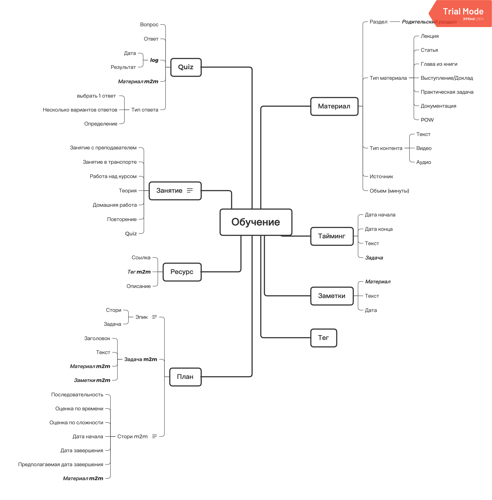

# Инструменты для работы с материалами и планом 

### Диалоговое окно для работы с материалами
- Добавлять новые ресурсы/материалы в несортированное
- Сортировать материалы и формировать roadmap (Упорядочить в ручную материалы)
- Добавить результат
- Сгенерировать расписание по доступным слотам времени
- Добавить quiz

### Генерация плана и индекса
- Отобразить roadmap и текущее положение
- Отобразить индексы материалов в markdown

### Статистика
- Сколько материалов осталось
- Статистика по потраченному времени

### Ручки
- Что учить следующим
- Телеграм бот, который будет присылать Quiz по расписанию / статистику за неделю
