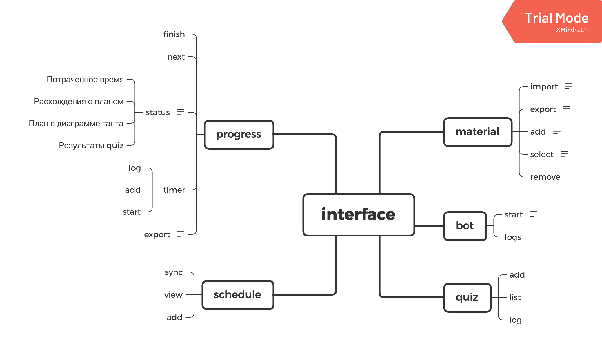

# Инструменты для работы с материалами и планом

Для качественного освоения и изучения материалов, нужны инструменты, нативно интегрирующиеся в тем жизни.
Материалы должны быть оценены, взвешаны и предложены в наиболее подходящий момент. Материалы нужно обсуждать, а результатами делиться. Без этого процесс образования становится не полноценным.

- Индексация и упорядочивание материалов, процесса обучения
- Повторение материалов / Quiz
- Обсуждение
- Статистика по результатам

## Схема данных

## Схема интерфей

### Диалоговое окно для работы с материалами

- Добавлять новые ресурсы/материалы в несортированное
- Сортировать материалы и формировать roadmap (Упорядочить в ручную материалы)
- Добавить результат
- Сгенерировать расписание по доступным слотам времени
- Добавить quiz

### Генерация плана и индекса

- Отобразить roadmap и текущее положение
- Отобразить индексы материалов в markdown

### Статистика

- Сколько материалов осталось
- Статистика по потраченному времени

### Ручки

- Что учить следующим
- Телеграм бот, который будет присылать Quiz по расписанию / статистику за неделю
